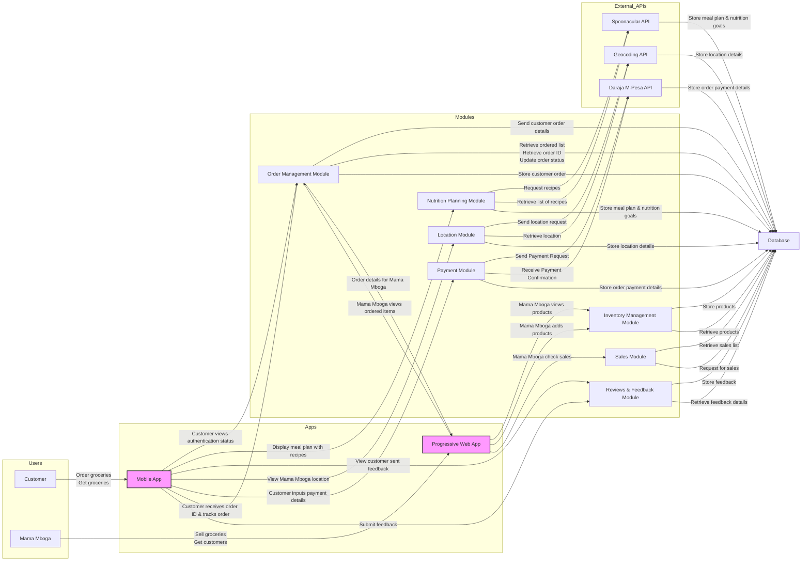

# Greens Mtaani System Architecture Diagram

The Greens Mtaani System Architecture Diagram presents a high-level overview of the components, interactions, and data flow within the Greens Mtaani application. This diagram serves as a visual guide to understanding how different modules of the system collaborate to deliver a seamless user experience, support operational efficiency, and ensure secure management of information. By examining this architecture, stakeholders and developers gain clarity on the system’s structure, scalability, and integration points, laying a solid foundation for development and future enhancements.


The Greens Mtaani platform adopts a microservices-inspired architecture with a clear separation of concerns. Below is a markdown diagram of the system architecture:



---

**Key Architectural Elements:**
- **Frontend**: React (with Redux) for web/mobile, Progressive Web App for Mama Mboga.
- **Backend**: Django REST Framework, microservices-inspired modular approach.
- **Database**: PostgreSQL.
- **External APIs**: M-Pesa (payments), Google Maps (location), Spoonacular (nutrition/recipes).
- **Modules**: Order, Payment, Nutrition, Location, Inventory, Sales, Reviews/Feedback.
- **Security**: JWT-based authentication, role-based authorization, encryption at rest and in transit.

```
- Customers interact via mobile app for ordering, payments, meal planning, viewing locations, and feedback.
- Sellers (Mama Mboga) use the web app for product management, order tracking, and sales analytics.
- Each domain (orders, payments, inventory, etc.) is handled by its own module, interacting with external APIs and the central database.
- Security is enforced through JWT tokens, role-based access, and encryption.
```